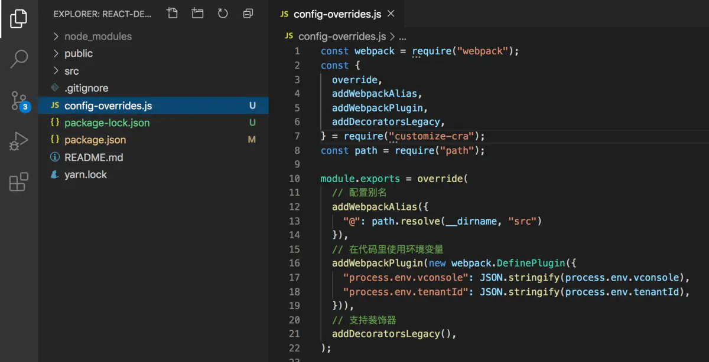

## create-react-app不用eject配置webpack
使用react-app-rewired
一般我们要改的配置并不多，这种情况下一个更好的选择是react-app-rewired，不需要生成一堆配置文件。

使用步骤：

安装相关的依赖：

```bash
npm i react-app-rewired --save-dev
npm i customize-cra --save-dev
```

修改package.json的scripts为
```json
  "scripts": {
    "start": "react-app-rewired start",
    "build": "react-app-rewired build",
    "test": "react-app-rewired test",
    "eject": "react-scripts eject"
  }
```
  
在根目录下添加config-overrides.js配置文件
具体支持的配置可以查看customize-cra文档 https://github.com/arackaf/customize-cra/blob/master/api.md

