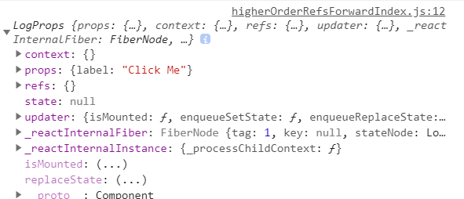

## forwardRef

Ref 转发是一个可选特性，其允许某些组件接收 ref，并将其向下传递（换句话说，“转发”它）给子组件。
何以使得父组件捕获到子组件内部的Dom。


### 转发Dom组件

- 通过调用 React.createRef 创建了一个 React ref 并将其赋值给 ref 变量。
- 通过指定 ref 为 JSX 属性，将其向下传递给 `<FancyButton ref={ref}>`。
- React 传递 ref 给 forwardRef 内函数 (props, ref) => ...，作为其第二个参数。
- 向下转发该 ref 参数到 `<button ref={ref}>`，将其指定为 JSX 属性。
- 当 ref 挂载完成，ref.current 将指向 `<button>` DOM 节点。

```

import React, { Component } from 'react'


// child
const FancyButton = React.forwardRef((props, ref) => (
    <button ref={ref} className="FancyButton">
      {props.children}
    </button>
  ));

// father
export default class refsForward extends Component {
    constructor(){
        super()
        this.ref = React.createRef();
    }
    componentDidMount(){
        console.log(this.ref.current);//child的button元素
    }
    render() {
        return (
            <div>
                <FancyButton ref={this.ref}>Click me!</FancyButton>;
            </div>
        )
    }
}

```

### 在高阶组件中转发 refs

refs 将不会透传下去。这是因为 ref 不是 prop 属性。就像 key 一样，其被 React 进行了特殊处理
所以再用高阶组件的时候，接受一个组件，然后返回另一个组件的时候，内部传递props的时候，如果props的有ref要做特殊处理
不然就会导致指向的是返回的LogProps，而不是本来的WrappedComponent

### 错误示范
高阶函数组件的定义
```
function logProps(WrappedComponent) {
  class LogProps extends React.Component {
    componentDidUpdate(prevProps) {
      console.log('old props:', prevProps);
      console.log('new props:', this.props);
    }

    render() {
      return <WrappedComponent {...this.props} />;
    }
  }

  return LogProps;
}

 class FancyButton extends React.Component {
    focus() {
      console.log("focus");
    }
    handleClick = ()=>{
        console.log('FancyButtonhandleClick')
    }
    render(){
        return(
            <div onClick={this.handleClick}>higherOrderRefsForwardIndex_FancyButton</div>
        )
    }
  

  }

// 我们导出 LogProps，而不是 FancyButton。
// 虽然它也会渲染一个 FancyButton。
export default logProps(FancyButton);

```

使用的时候
```

import React, { PureComponent } from "react";
import FancyButton from "./higherOrderRefsForward";

const ref = React.createRef();

export default class higherOrderRefsForwardIndex extends PureComponent {
  componentDidMount() {
      console.log(ref.current)
      //ref.current.focus()会报错，因为指向的是LogProps这个组件
  }
  render() {
    return (
      // 我们导入的 FancyButton 组件是高阶组件（HOC）LogProps。
      // 尽管渲染结果将是一样的，
      // 但我们的 ref 将指向 LogProps 而不是内部的 FancyButton 组件！
      // 这意味着我们不能调用例如 ref.current.focus() 这样的方法
      <FancyButton label="Click Me"  ref={ref} />
    );
  }
}

```



### 正确示范

React.forwardRef API 明确地将 refs 转发到内部的 FancyButton 组件

#### 高阶组件添加React.forwardRef
```
function logProps(Component) {
  class LogProps extends React.Component {
    componentDidUpdate(prevProps) {
      console.log('old props:', prevProps);
      console.log('new props:', this.props);
    }

    render() {
      const {forwardedRef, ...rest} = this.props;

      // 将自定义的 prop 属性 “forwardedRef” 定义为 ref
      return <Component ref={forwardedRef} {...rest} />;
    }
  }

  // 注意 React.forwardRef 回调的第二个参数 “ref”。
  // 我们可以将其作为常规 prop 属性传递给 LogProps，例如 “forwardedRef”
  // 然后它就可以被挂载到被 LogProps 包裹的子组件上。
  return React.forwardRef((props, ref) => {
    return <LogProps {...props} forwardedRef={ref} />;
  });
}


```


#### 传个组件给高阶组件包裹

```
  //higherOrderRefsForward.js
  class FancyButton extends React.Component {
    alert(){
        alert('FancyButton')
    }
    render(){
        return(
            <div onClick={this.props.handleClick}>点击通过父组件调用组件的方法</div>
        )
    }
  }
  export default logProps(FancyButton)
```

#### 调用FancyButton

```
import React, { PureComponent } from "react";
import FancyButton from "./higherOrderRefsForward";

const ref = React.createRef();

export default class higherOrderRefsForwardIndex extends PureComponent {
  handleChangeColor(){
      //现在ref是挂载在FancyButton这个组件上，虽然经过高阶组件修饰也可以正确的挂载，就可以调用FancyButton内部的方法了
      console.log(ref.current)
      ref.current.alert()
  }
  render() {
    return (
      <FancyButton handleClick={this.handleChangeColor} label="Click Me"  ref={ref} />
    );
  }
}

```

## 参考文章

- https://zh-hans.reactjs.org/docs/forwarding-refs.html