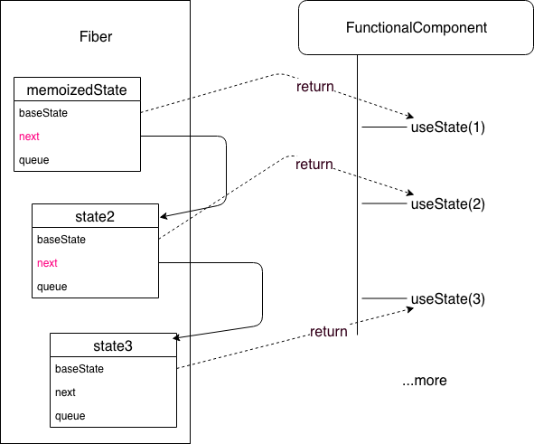

## 为什么需要hooks

- 设计Hooks主要是解决ClassComponent的几个问题：
  - 很难复用逻辑（只能用HOC，或者render props），会导致组件树层级很深
  - 会产生巨大的组件（指很多代码必须写在类里面）
  - 类组件很难理解，比如方法需要bind，this指向不明确
- 能在无需修改组件结构的情况下复用状态逻辑（自定义 Hooks ）
- 能将组件中相互关联的部分拆分成更小的函数（比如设置订阅或请求数据）
- 副作用的关注点分离：副作用指那些没有发生在数据向视图转换过程中的逻辑，如 ajax 请求、访问原生dom 元素、本地持久化缓存、绑定/解绑事件、添加订阅、设置定时器、记录日志等。以往这些副作用都是写在类组件生命周期函数中的。而 useEffect 在全部渲染完毕后才会执行，useLayoutEffect 会在浏览器 layout 之后，painting 之前执行。

## React Hooks 实现原理

### Fiber节点的数据结构

```
function FiberNode(
  tag: WorkTag,
  pendingProps: mixed,
  key: null | string,
  mode: TypeOfMode,
) {
  // Instance
  this.tag = tag;
  this.key = key;
  this.elementType = null;  // 就是ReactElement的`$$typeof`
  this.type = null;         // 就是ReactElement的type
  this.stateNode = null;

  // Fiber
  this.return = null;
  this.child = null;
  this.sibling = null;
  this.index = 0;

  this.ref = null;

  this.pendingProps = pendingProps;
  this.memoizedProps = null;
  this.updateQueue = null;
  this.memoizedState = null;
  this.firstContextDependency = null;

  // ...others
}

```

### memoizedState

Hooks中，React并不知道我们调用了几次useState，所以在保存state这件事情上，React想出了一个比较有意思的方案，那就是调用useState后设置在memoizedState上的对象长

```
{
  baseState,
  next,
  baseUpdate,
  queue,
  memoizedState
}

```

在FunctionalComponent中调用的useState都会有一个对应的Hook对象，他们按照执行的顺序以类似链表的数据格式存放在Fiber.memoizedState上。

应该在创建新Fiber Tree（workInProgressTree）的时候把指针指回来？(个人猜测)

###  如何取出hooks的数据

react会生成一个Fiber树，每个组件在Fiber树上都有对应的节点FiberNode。组件的所有hook状态都存在FiberNode的memoizedState属性上。
当执行这个函数组件的时候，第一次useSomeHook语句，就会去取第一个hook状态。
第二次遇到useSomeHook语句，就取第二个hook状态。以此类推。
所以，可以把这些hook状态理解成一个数组（但其实是个链表）。




## 模拟实现useState

```
import React from 'react';
import ReactDOM from 'react-dom';

let firstWorkInProgressHook = {memoizedState: null, next: null};
let workInProgressHook;

function useState(initState) {
    let currentHook = workInProgressHook.next ? workInProgressHook.next : {memoizedState: initState, next: null};

    function setState(newState) {
        currentHook.memoizedState = newState;
        render();
    }
  	// 这就是为什么 useState 书写顺序很重要的原因
		// 假如某个 useState 没有执行，会导致指针移动出错，数据存取出错
    if (workInProgressHook.next) {
        // 这里只有组件刷新的时候，才会进入
        // 根据书写顺序来取对应的值
        // console.log(workInProgressHook);
        workInProgressHook = workInProgressHook.next;
    } else {
        // 只有在组件初始化加载时，才会进入
        // 根据书写顺序，存储对应的数据
        // 将 firstWorkInProgressHook 变成一个链表结构
        workInProgressHook.next = currentHook;
        // 将 workInProgressHook 指向 {memoizedState: initState, next: null}
        workInProgressHook = currentHook;
        // console.log(firstWorkInProgressHook);
    }
    return [currentHook.memoizedState, setState];
}

function Counter() {
    // 每次组件重新渲染的时候，这里的 useState 都会重新执行
    const [name, setName] = useState('计数器');
    const [number, setNumber] = useState(0);
    return (
        <>
            <p>{name}:{number}</p>
            <button onClick={() => setName('新计数器' + Date.now())}>新计数器</button>
            <button onClick={() => setNumber(number + 1)}>+</button>
        </>
    )
}

function render() {
    // 每次重新渲染的时候，都将 workInProgressHook 指向 firstWorkInProgressHook
    workInProgressHook = firstWorkInProgressHook;
    ReactDOM.render(<Counter/>, document.getElementById('root'));
}

render();

```

## Effect Hook
> 原理：https://react.jokcy.me/book/hooks/hooks-use-effect.html

### useEffect()
useEffect() 可以让你在函数组件中执行副作用操作
默认情况下，它在第一次渲染之后和每次更新之后都会执行。
如果你熟悉 React class 的生命周期函数，你可以把 useEffect Hook 看做 componentDidMount，componentDidUpdate 和 componentWillUnmount(Effect最后return的函数) 这三个函数的组合。

### useLayoutEffect


其函数签名与 useEffect 相同，但它会在所有的 DOM 变更之后同步调用 effect。可以使用它来读取 DOM 布局并同步触发重渲染。在浏览器执行绘制之前，useLayoutEffect 内部的更新计划将被同步刷新。

useLayoutEffect和useEffect类似，但是不同的是：

- useEffect，使用useEffect不会阻塞浏览器的重绘
- useLayoutEffect, 使用useLayoutEffect，会阻塞浏览器的重绘。如果你需要手动的修改Dom，推荐使用useLayoutEffect。因为如果在useEffect中更新Dom，useEffect不会阻塞重绘，用户可能会看到因为更新导致的闪烁（https://juejin.im/post/5de38c76e51d455f9b335eff


## React 子组件Props改变触发渲染

### 直接使用 

这种方式，父组件改变props后，子组件重新渲染，由于直接使用的props，所以我们不需要做什么就可以正常显示最新的props

```
class Child extends Component {
    render() {
        return <div>{this.props.someThings}</div>
    }
}
```

### 转换成自己的state

这种方式，由于我们使用的是state，所以每当父组件每次重新传递props时，我们需要重新处理下，将props转换成自己的state，这里就用到了 componentWillReceiveProps。

```
    componentWillReceiveProps(nextProps) {
        this.setState({
            text: nextProps.text
        });
    }

```

## Hooks如何减少子组件渲染次数

hooks 没有state,并且每次更新相当于重新执行了一次函数

默认情况，只要父组件状态变了（不管子组件依不依赖该状态），子组件也会重新渲染

### 一般的优化：

类组件：可以使用 pureComponent ；
函数组件：使用 React.memo ，将函数组件传递给 memo 之后，就会返回一个新的组件，新组件的功能：如果接受到的属性不变，则不重新渲染函数(只对props进行浅比较)


### 但是怎么保证属性不会变呢 

这里使用 useState ，每次更新都是独立的，setNumber后相当于整个组件重新执行了一次，

const [number,setNumber] = useState(0) 也就是说每次都会生成一个新的值（哪怕这个值没有变化），即使使用了 React.memo ，也还是会重新渲染


### 更深入的优化 useCallback useMemo：

useCallback：接收一个内联回调函数参数和一个依赖项数组（子组件依赖父组件的状态，即子组件会使用到父组件的值） ，useCallback 会返回该回调函数的 
memoized 版本，该回调函数仅在某个依赖项改变时才会更新

```
const memoizedCallback = useCallback(
  () => {
    doSomething(a, b);
  },
  [a, b],
);
```

useMemo：把创建函数和依赖项数组作为参数传入 useMemo，它仅会在某个依赖项改变时才重新计算 memoized 值。这种优化有助于避免在每次渲染时都进行高开销的计算
```
// 这里useMemo第一个参数返回的是函数的计算结果，是一个量
const memoizedValue = useMemo(() => computeExpensiveValue(a, b), [a, b]);
```

区别：useMemo返回的是一个变量(可以把计算这个变量的过程放入hook，避免重复计算)，而useCallback返回的是一个函数(就是传入的第一个参数)


useCallback(fn, deps) 相当于 useMemo(() => fn, deps)。useMemo返回的变量变成了函数。好像区别也就是第一个回调的返回值一个是函数，一个是数值

## useState的一些优化

### 避免闭包导致hooks状态未更新

```
function DelayedCount() {
  const [count, setCount] = useState(0);

  const handleClickAsync = () => {
    setTimeout(function delay() {
      //setCount(count + 1);多次点击不能这么写，不然你点三下也是+1，和setSate的批量更新有点类似
      // 闭包（例如事件处理程序，回调）可能会从函数组件作用域中捕获状态变量,闭包捕获了过时的状态值可能就无法更新
      // 可以使用回调写法
      setCount(count => count + 1);
    }, 3000);
  }

  return (
    <div>
      {count}
      <button onClick={handleClickAsync}>Increase async</button>
    </div>
  );
}

```

### useState批量更新

setCount后不会马上更新，会被后面的合并，setCount最后替换成0+1=1，且只会触发一次渲染。
与在类中使用 setState 的异同点：
- 相同点：也是异步的，例如在 合成事件与生命周期中(包含useEffect)，调用两次 setState，数据只改变一次。
- 不同点：
  - 类中的 setState 是合并，而函数组件中的 setState 是替换。
  - hooks前者每次更新后state都是新值，换而言之其实是不可变数据的概念。而后者使用后，其实更新state部分的值，引用本身并无改变。
```
import React, { useState } from "react";
import ReactDOM from "react-dom";

import "./styles.css";

function DelayedCount() {
  const [count, setCount] = useState(0);

  const handleClickAsync = () => {
    setCount(count + 1);
    setCount(count + 1);
    setCount(count + 1);
  };
  // 更新后也只会打出一个123，也就是只有一次setCount
  console.log(123);
  return (
    <div>
      {count}
      <button onClick={handleClickAsync}>Increase async</button>
    </div>
  );
}

const rootElement = document.getElementById("root");
ReactDOM.render(<DelayedCount />, rootElement);
```

### 避免useState重复初始化

```
// 直接传入一个值，在每次 render 时都会执行 createRows 函数获取返回值
const [rows, setRows] = useState(createRows(props.count));
```
改为传入一个函数
```
// createRows 只会被执行一次
const [rows, setRows] = useState(() => createRows(props.count));
```

### 各种封装的hooks

- https://zh-hans.reactjs.org/docs/hooks-reference.html
- https://streamich.github.io/react-use/


## 自定义Hooks


基于Hooks，我们可以把可复用的状态逻辑抽离到一个函数中作为自定义Hooks，通过多个Hooks的组合完成复杂逻辑共享。

多处复用同一个Hooks时，只是复用Hooks的处理状态的逻辑，每一个Hooks中的状态都是独立的。

函数式组件结合hooks，组件的每一次渲染获得的state都是独立的，可以实现多种状态的组件需求，而class类组件中访问的this永远是指向最新的实例状态

- Hook 是一种复用状态逻辑的方式，它不复用 state 本身
- 事实上 Hook 的每次调用都有一个完全独立的 state。自定义 Hook 是一种重用状态逻辑的机制(例如设置为订阅并存储当前值)，所以每次使用自定义 Hook 时，其中的所有 state 和副作用都是完全隔离的。
- 自定义 Hook 更像是一种约定，而不是一种功能。如果函数的名字以 use 开头，并且调用了其他的 Hook，则就称其为一个自定义 Hook。（use开头的函数React会检测hooks写法是否符合规则）
- 自定义 Hook 是一种自然遵循 Hook 设计的约定，而并不是 React 的特性


## 在多个 Hook 之间传递信息
由于 Hook 本身就是函数，因此我们可以在它们之间传递信息。

```
  const [recipientID, setRecipientID] = useState(1);
  const isRecipientOnline = useFriendStatus(recipientID);
```

## 自定义Hooks的调用关系
>个人感觉执行方式和自定义hooks的函数内容展开放到外面一致，也就是说自定义hooks内部的setValue会导致外面使用该Hooks的组件更新

```js
 export default function Counter() {
    const h1 = useRef(null)
    useEffect(() => {
        console.log('Counter1')
      });
    const [count, setCount] = useState(0);
    const prevCount = usePrevious2(count);
    console.log('prevCount',0)
    useEffect(() => {
        console.log('Counter2',h1)
      });
 return <h1 ref={h1} onClick={()=>setCount(count+1)}>Now: {count}, before: {prevCount}{console.log(h1)}</h1>;
  }
  

  // 内部useEffect其实就是在Counter挂载完后执行的副作用
  // 所以useEffect在返回后执行 所以prevCount第一次打出来是undefined
  function usePrevious2(value) {
    console.log(1)
    const ref = useRef();
    useEffect(() => {
        console.log(2)
      ref.current = value;
    });
    console.log(3)
    return ref.current;
  }
```

```
usePrevious.js:45 1
usePrevious.js:51 3
usePrevious.js:34 prevCount 0
usePrevious.js:38 {current: null} // beforeAmount
// 按照effects注册的顺序调用
usePrevious.js:30 Counter1 // didAmount
usePrevious.js:48 2
usePrevious.js:36 Counter2 {current: h1}
```


### Hooks一般不要与UI耦合
>https://zhuanlan.zhihu.com/p/100683538?hmsr=toutiao.io 谈React Hooks的逻辑抽象与封装


## 依赖项的写法

如果你指定了一个 依赖列表 作为 useEffect、useLayoutEffect、useMemo、useCallback 或 useImperativeHandle 的最后一个参数，它必须包含回调中的所有值，并参与 React 数据流。这就包括 props、state，以及任何由它们衍生而来的东西。

在依赖列表中省略函数是否安全？
```jsx
function Example({ someProp }) {
  function doSomething() {
    console.log(someProp);
  }

  useEffect(() => {
    doSomething();
  }, []); // 🔴 这样不安全（它调用的 `doSomething` 函数使用了 `someProp`）
}
```

要记住 effect 外部的函数使用了哪些 props 和 state 很难。这也是为什么 通常你会想要在 effect 内部 去声明它所需要的函数。 这样就能容易的看出那个 effect 依赖了组件作用域中的哪些值：

```JSX
function Example({ someProp }) {
  useEffect(() => {
    function doSomething() {
      console.log(someProp);
    }

    doSomething();
  }, [someProp]); // ✅ 安全（我们的 effect 仅用到了 `someProp`）
}
```

万不得已的情况下，你可以 把函数加入 effect 的依赖但 把它的定义包裹 进 useCallback Hook。这就确保了它不随渲染而改变，除非 它自身 的依赖发生了改变：

```TSX
function ProductPage({ productId }) {
  // ✅ 用 useCallback 包裹以避免随渲染发生改变
  const fetchProduct = useCallback(() => {
    // ... Does something with productId ...
  }, [productId]); // ✅ useCallback 的所有依赖都被指定了

  return <ProductDetails fetchProduct={fetchProduct} />;
}

function ProductDetails({ fetchProduct }) {
  useEffect(() => {
    fetchProduct();
  }, [fetchProduct]); // ✅ useEffect 的所有依赖都被指定了
  // ...
}
```

## 如何从 useCallback 读取一个经常变化的值？

在某些罕见场景中，你可能会需要用 useCallback 记住一个回调，但由于内部函数必须经常重新创建，记忆效果不是很好。如果你想要记住的函数是一个事件处理器并且在渲染期间没有被用到，你可以 把 ref 当做实例变量 来用，并手动把最后提交的值保存在它当中：

```JSX
function Form() {
  const [text, updateText] = useState('');
  const textRef = useRef();

  useEffect(() => {
    textRef.current = text; // 把它写入 ref
  });

  const handleSubmit = useCallback(() => {
    const currentText = textRef.current; // 从 ref 读取它
    alert(currentText);
  }, [textRef]); // 不要像 [text] 那样重新创建 handleSubmit

  return (
    <>
      <input value={text} onChange={e => updateText(e.target.value)} />
      <ExpensiveTree onSubmit={handleSubmit} />
    </>
  );
}
```

这是一个比较麻烦的模式，但这表示如果你需要的话你可以用这条出路进行优化。如果你把它抽取成一个自定义 Hook 的话会更加好受些：
```JSX
function Form() {
  const [text, updateText] = useState('');
  // 即便 `text` 变了也会被记住:
  const handleSubmit = useEventCallback(() => {
    alert(text);
  }, [text]);

  return (
    <>
      <input value={text} onChange={e => updateText(e.target.value)} />
      <ExpensiveTree onSubmit={handleSubmit} />
    </>
  );
}

function useEventCallback(fn, dependencies) {
  const ref = useRef(() => {
    throw new Error('Cannot call an event handler while rendering.');
  });

  useEffect(() => {
    ref.current = fn;
  }, [fn, ...dependencies]);

  return useCallback(() => {
    const fn = ref.current;
    return fn();
  }, [ref]);
}
```

无论如何，我们都 不推荐使用这种模式 ，只是为了文档的完整性而把它展示在这里。相反的，我们更倾向于 避免向下深入传递回调(用context+dispatch)。