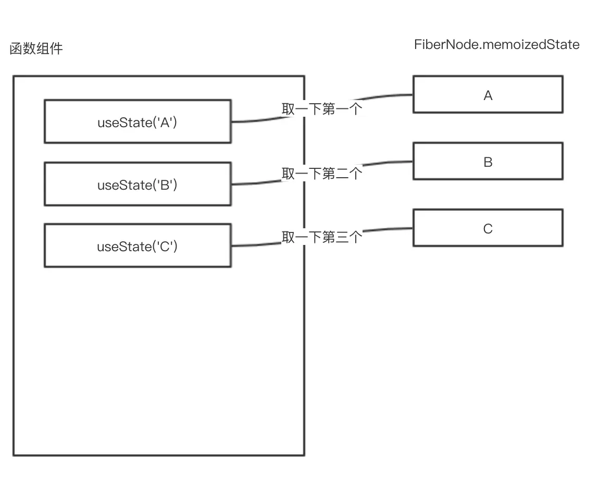

## React Hooks 实现原理

react会生成一个Fiber树，每个组件在Fiber树上都有对应的节点FiberNode。组件的所有hook状态都存在FiberNode的memoizedState属性上。
当执行这个函数组件的时候，第一次useSomeHook语句，就会去取第一个hook状态。
第二次遇到useSomeHook语句，就取第二个hook状态。以此类推。
所以，可以把这些hook状态理解成一个数组（但其实是个链表）。




## React 子组件Props改变触发渲染

### 直接使用 

这种方式，父组件改变props后，子组件重新渲染，由于直接使用的props，所以我们不需要做什么就可以正常显示最新的props

```
class Child extends Component {
    render() {
        return <div>{this.props.someThings}</div>
    }
}
```

### 转换成自己的state

这种方式，由于我们使用的是state，所以每当父组件每次重新传递props时，我们需要重新处理下，将props转换成自己的state，这里就用到了 componentWillReceiveProps。

```
    componentWillReceiveProps(nextProps) {
        this.setState({
            text: nextProps.text
        });
    }

```

## Hooks如何减少子组件渲染次数

hooks 没有state,并且每次更新相当于重新执行了一次函数

默认情况，只要父组件状态变了（不管子组件依不依赖该状态），子组件也会重新渲染

### 一般的优化：

类组件：可以使用 pureComponent ；
函数组件：使用 React.memo ，将函数组件传递给 memo 之后，就会返回一个新的组件，新组件的功能：如果接受到的属性不变，则不重新渲染函数；


### 但是怎么保证属性不会变呢 

这里使用 useState ，每次更新都是独立的，setNumber后相当于整个组件重新执行了一次，

const [number,setNumber] = useState(0) 也就是说每次都会生成一个新的值（哪怕这个值没有变化），即使使用了 React.memo ，也还是会重新渲染


### 更深入的优化：

useCallback：接收一个内联回调函数参数和一个依赖项数组（子组件依赖父组件的状态，即子组件会使用到父组件的值） ，useCallback 会返回该回调函数的 
memoized 版本，该回调函数仅在某个依赖项改变时才会更新

useMemo：把创建函数和依赖项数组作为参数传入 useMemo，它仅会在某个依赖项改变时才重新计算 memoized 值。这种优化有助于避免在每次渲染时都进行高开销的计算


