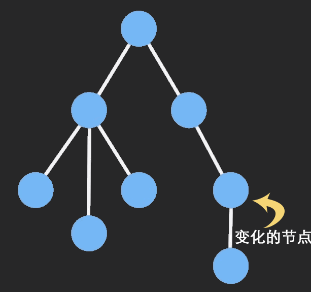

## 什么是 immutable 数据

immutable 数据一种利用结构共享形成的持久化数据结构，一旦有部分被修改，那么将会返回一个全新的对象，并且原来相同的节点会直接共享。

### Immutable数据

Never mutated, instead copy it and then make change.
绝对不要突然修改对象，首先复制然后修改复制对象，再返回这个新对象，保持原对象不变。

Immutable对象和原生JavaScript对象的主要差异可以概括为以下两点：

持久化数据结构（Persistent data structures）
结构共享（Structures sharing Trie）


### 持久化数据结构

持久数据结构主张所有操作都返回该数据结构的更新副本，并保持原有结构不变，而不是改变原来的结构。通常利用Trie构建它不可变的持久性数据结构，它的整体结构可以看作一棵树，一个树节点可以对应代表对象某一个属性，节点值即属性值。

### 结构共享

一旦创建一个Immutable Trie型对象，我们可以把该Trie型对象想象成如下一棵树，在之后的对象变更尽可能的重用树节点

### 总结一下
- Immutable Data 就是一旦创建，就不能再被更改的数据。 
- 对 Immutable 对象的任何修改或添加删除操作都会返回一个新的 Immutable 对象。 
- Immutable 实现的原理是 Persistent Data Structure（持久化数据结构），也就是使用旧数据创建新数据时，要保证旧数据同时可用且不变。 
- 同时为了避免 deepCopy 把所有节点都复制一遍带来的性能损耗，Immutable 使用了 Structural Sharing（结构共享），即如果对象树中一个节点发生变化，只修改这个节点和受它影响的父节点，其它节点则进行共享。
- 请看下面动画：



## 为什么需要Immutable

不可变，副作用及突变
我们不鼓励突然变更对象，因为那通常会打断时间旅行及bug相关调试，并且在react-redux的connect方法中状态突变将导致组件性能低下：

- 时间旅行：Redux DevTools开发工具期望应用在重新发起某个历史action时将仅仅返回一个状态值，而不改变任何东西，即无副作用。突变和异步操作将导致时间旅行混乱，行为不可预测。

- react-redux：connect方法将检查mapStateToProps方法返回的props对象是否变更以决定是否需要更新组件。为了提高这个检查变更的性能，connect方法基于Immutabe状态对象进行改进，使用浅引用相等性检查来探测变更。这意味着对对象或数组的直接变更将无法被探测，导致组件无法更新。

在reducer函数中的诸如生成唯一ID或时间戳的其他副作用也会导致应用状态不可预测，难以调试和测试。

## immutable在React中的作用

### React 的组件更新过程的优化

#### React 的组件更新过程

当某个 React 组件发生更新时（state 或者 props 发生改变），React 将会根据新的状态构建一棵新的 Virtual DOM 树，然后使用 diff 算法将这个 Virtual DOM 和 之前的 Virtual DOM 进行对比，如果不同则重新渲染。React 会在渲染之前会先调用 shouldComponentUpdate 这个函数是否需要重新渲染，整个链路的源码分析可参照这里,React 中 shouldComponentUpdate 函数的默认返回值是 true，所以组件中的任何一个位置发生改变了，组件中其他不变的部分也会重新渲染。

####  组件更新的问题

对于嵌套对象，必须迭代层层进行检查判断，耗费时间过长；
若仅修改对象的属性，其引用保持不变，相等性检查中的引用检查结果不变，又不会触发渲染；
Immutable提供一直简单快捷的方式以判断对象是否变更，对于React组件更新和重新渲染性能可以有较大帮助。

#### PureComponent 的浅比较优化

```
 if (this._compositeType === CompositeTypes.PureClass) {
      shouldUpdate =
        !shallowEqual(prevProps, nextProps) ||
        !shallowEqual(inst.state, nextState);
 }
```
虽然可以避免没有改变的元素发生不必要的重新渲染，但是使用上面的这种浅比较还是会带来一些问题

引用类型，当更改了其中的某一字段，并期望在改变之后组件可以重新渲染的时候，发现使用 PureComponent 的时候，发现组件并没有重新渲染，因为更改后的数据和修改前的数据使用的同一个内存，所有比较的结果永远都是 false, 导致组件并没有重新渲染。

在shouldComponentUpdate加上一层对比,前提是props上的的属性都是immutable数据
```
import {is} from 'immutable';
 for (const key in nextProps) {
            if (!is(thisProps[key], nextProps[key])) {
                return true;
            }
        }
```

#### 状态组件state更新优化

错误的写法：
```
    this.state = fromJS({
      person: {
        name: 'xuxuan',
        age: 12
      }
    })

    this.setState(preState => {
      return preState.update(['person', 'name'], v => v + 'update')//报错：preSate没有update 方法。

    })
```

因为 state 本身必须是 plain object，但是里面的值可以是 immutable 的数据

所以：

```
this.state = {
    person: fromJS({
        name: 'xuxuan',
        age: 12
    })
}

this.setState({
    person: this.state.person.update('name', v => v + 'update')
})
```

将state转为immutable数据修改后会触发更新 


如果不转为`immutable`数据,直接从`this.state.person.name = XX` 不会触发更新，因为浅比较的缘故


### 在Redux中使用

- 在redux中，全局state必须是immutable的，这点毋庸置疑是我们使用immutable来优化redux的核心
- 组件内部state如果需要提交到store的，必须是immutable，否则不强制
- view提交到action中的数据必须是immutable
- Action提交到reducer中的数据必须是immutable
- reducer中最终处理state必须是以immutable的形式处理并返回
- 与服务端ajax交互中返回的callback统一封装，第一时间转换成immutable数据


#### 全局挂载用combineReducers

 在redux中，全局state必须是immutable的，这点毋庸置疑是我们使用immutable来优化redux的核心
```
import { combineReducers } from "redux-immutable";
import { reducer as recommendReducer } from "../application/Recommend/store/index";
import { reducer as singersReducer } from "../application/Singers/store/index";
import { reducer as rankReducer } from "../application/Rank/store/index";
import { reducer as albumReducer } from "../application/Album/store/index";
import { reducer as singerInfoReducer } from "../application/Singer/store/index";
import { reducer as playerReducer } from "../application/Player/store/index";
import { reducer as searchReducer } from "../application/Search/store/index";
import { reducer as userReducer } from "../application/User/Login/store/index";

export default combineReducers({
  recommend: recommendReducer,
  singers: singersReducer,
  rank: rankReducer,
  album: albumReducer,
  singerInfo: singerInfoReducer,
  player: playerReducer,
  search: searchReducer,
  user: userReducer
});
```

#### reducer.js

Action提交到reducer中的数据必须是immutable

```
import { fromJS } from 'immutable';

const defaultState = fromJS({
  bannerList: [],
  recommendList: [],
  enterLoading: true
})

export default (state = defaultState, action) => {
  switch(action.type) {
    case actionTypes.CHANGE_BANNER:
      return state.set('bannerList', action.data);
    case actionTypes.CHANGE_RECOMMEND_LIST:
      return state.set('recommendList', action.data);
    case actionTypes.CHANGE_ENTER_LOADING:
      return state.set('enterLoading', action.data);
    default:
      return state;
  }
}
```

#### actionCreators.js

Action提交到reducer中的数据必须是immutable
与服务端ajax交互中返回的callback统一封装，第一时间转换成immutable数据
```
import { fromJS } from 'immutable';
import { getBannerRequest, getRecommendListRequest } from '../../../api/request';

...
export const changeBannerList = (data) => ({
  type: actionTypes.CHANGE_BANNER,
  data: fromJS(data)
});

export const changeRecommendList = (data) => ({
  type: actionTypes.CHANGE_RECOMMEND_LIST,
  data: fromJS(data)
});

export const getBannerList = () => {
  return (dispatch) => {
    getBannerRequest().then(data => {
      const action = changeBannerList(data.banners);
      dispatch(action);
    }).catch(() => {
      console.log("轮播图数据传输错误");
    }) 
  }
};
....
```

#### index.js

view提交到action中的数据必须是immutable 这里是用了redux-thunk这个中间件
```
import thunk from "redux-thunk";
const store = createStore(reducer, composeEnhancers(applyMiddleware(thunk)));
```
所以传给dispatch是一个函数，函数执行完反的就是带有immutable数据的action

```
·····
const { bannerList, recommendList, songsCount, enterLoading } = props;

  const { getBannerDataDispatch, getRecommendListDataDispatch } = props;

  useEffect(() => {
    if(!bannerList.size){
      getBannerDataDispatch();
    }
    if(!recommendList.size){
      getRecommendListDataDispatch();
    }
    // eslint-disable-next-line
  }, []);

  const bannerListJS = bannerList ? bannerList.toJS() : [];
  const recommendListJS = recommendList ? recommendList.toJS() :[];

const mapStateToProps = (state) => ({
  bannerList: state.getIn(['recommend', 'bannerList']),
  recommendList: state.getIn(['recommend', 'recommendList']),
  songsCount: state.getIn(['player', 'playList']).size,
  enterLoading: state.getIn(['recommend', 'enterLoading'])
});

const mapDispatchToProps = (dispatch) => {
  return {
    getBannerDataDispatch() {
      dispatch(actionTypes.getBannerList());
    },
    getRecommendListDataDispatch() {
      dispatch(actionTypes.getRecommendList());
    },

  }
};

export default connect(mapStateToProps, mapDispatchToProps)(React.memo(Recommend));
·····
```

## 参考文章

- https://github.com/immutable-js/immutable-js
- https://segmentfault.com/a/1190000010676878
- https://github.com/ronffy/immer-tutorial
- https://juejin.im/post/5ac437436fb9a028c97a437c
- Redux实例参考神三元小册
