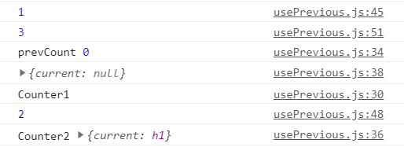

## usrRef

### 获取DOM节点


这是因为它创建的是一个普通 Javascript 对象。而 useRef() 和自建一个 {current: ...} 对象的唯一区别是，useRef 会在每次渲染时返回同一个 ref 对象。

请记住，当 ref 对象内容发生变化时，useRef 并不会通知你。变更 .current 属性不会引发组件重新渲染。如果想要在 React 绑定或解绑 DOM 节点的 ref 时运行某些代码，则需要使用回调 ref 来实现。

```
import React, { useRef,useState} from 'react';
function DomInput(){
    const inputEl = useRef(null)
    console.log(inputEl) //输出获取到的DOM节点

    const [text, setText] = useState('默认值'); 
    const onInput=()=>{ 
        console.log(inputEl)
        setText(inputEl.current.value)
        console.log(inputEl) //输出获取到的DOM节点
    }
    return (
        <>
            {/*保存input的ref到inputEl */}
            <input ref={inputEl} type="text" onInput = {onInput}/>
            <div  >{text}</div>
        </>
    )
}
export default DomInput

```


### 渲染周期之间共享数据的存储(类似实例变量)

useRef() Hook 不仅可以用于 DOM refs。「ref」 对象是一个 current 属性可变且可以容纳任意值的通用容器，类似于一个 class 的实例属性，可以很方便地保存任何可变值。

**ref对象与自建一个{current：‘’}对象的区别是：useRef会在每次渲染时返回同一个ref对象，即返回的ref对象在组件的整个生命周期内保持不变。自建对象每次渲染时都建立一个新的。**

这可以用来保存获取上一轮的 props 或 state
```
 export default function Counter() {
    const h1 = useRef(null)
    useEffect(() => {
        console.log('Counter1')
      });
    const [count, setCount] = useState(0);
    const prevCount = usePrevious2(count);
    console.log(prevCount)
    useEffect(() => {
        console.log('Counter2',h1)
      });
 return <h1 ref={h1} onClick={()=>setCount(count+1)}>Now: {count}, before: {prevCount}{console.log(h1)}</h1>;
  }
  
  // 内部useEffect其实就是在Counter挂载完后执行的副作用
  // 所以useEffect在返回后执行 所以prevCount第一次打出来是undefined
  function usePrevious2(value) {
    console.log(1)
    const ref = useRef();
    useEffect(() => {
        console.log(2)
      ref.current = value;
    });
    console.log(3)
    return ref.current;
  }


```



### 来和 React.createRef() 来做一个对比

React.createRef()返回的对象每次更新渲染后都换变，而useRef始终如一

```js
import React, { useRef, useEffect, createRef, useState } from 'react';
function MyInput() {
    let [count, setCount] = useState(0);

    const myRef = createRef(null);
    const inputRef = useRef(null);
    //仅执行一次
    useEffect(() => {
        inputRef.current.focus();
        window.myRef = myRef;
        window.inputRef = inputRef;
    }, []);
    
    useEffect(() => {
        //除了第一次为true， 其它每次都是 false 【createRef】
        console.log('myRef === window.myRef', myRef === window.myRef);
        //始终为true 【useRef】
        console.log('inputRef === window.inputRef', inputRef === window.inputRef);
    })
    return (
        <>
            <input type="text" ref={inputRef}/>
            <button onClick={() => setCount(count+1)}>{count}</button>
        </>
    )
}

```


### useRef() 与 callback ref

useRef 会在每次渲染时返回同一个 ref , 而自建一个 {current: ...}赋值给ref不是

当 ref 对象内容发生变化时，useRef 并不会通知你。

**变更 .current 属性不会引发组件重新渲染。**

如果想要在 React 绑定或解绑 DOM 节点的 ref 时运行某些代码，则需要使用回调 ref 来实现。

要想测量一个 DOM 节点的位置或是尺寸，你可以使用 callback ref。每当 ref 被附加到一个另一个节点，React 就会调用 callback

```
function MeasureExample() {
  const [height, setHeight] = useState(0);

  const measuredRef = useCallback(node => {
    if (node !== null) {
      setHeight(node.getBoundingClientRect().height);
    }
  }, []);

  return (
    <>
      <h1 ref={measuredRef}>Hello, world</h1>
      <h2>The above header is {Math.round(height)}px tall</h2>
    </>
  );
}
```

## 为什么一般封装自定义Hooks的时候都喜欢用useRef的current来保存变量或函数

### 案例1 缓存函数

通过上面的特性就很好理解了。封装意味着我们的自定义hooks是一个函数。函数就可能导致闭包。在函数作为参数传入我们自定义hooks的时候，由于hooks会重复执行，导致上下文不一致的情况。

```TSX
import { useEffect, useRef } from 'react';

const useUnmount = (fn: any) => {
  const fnRef = useRef(fn);

  //* 更新每个呈现的ref，这样如果它改变，最新的回调将被调用 避免闭包
  fnRef.current = fn;

  useEffect(
    () => () => {
      if (fnRef.current && typeof fnRef.current === 'function') {
        fnRef.current();
      }
    },
    [],
  );
};

export default useUnmount;
```
再看一个复杂的应用：持久化函数
```TSX
// 持久化 function 的 Hook usePersistFn，可以保证persistFn函数地址永远不会变化
// 在某些场景中，你可能会需要用 useCallback 记住一个回调，
// 但由于内部函数必须经常重新创建，记忆效果不是很好，导致子组件重复 render。
// 对于超级复杂的子组件，重新渲染会对性能造成影响
function usePersistFn<T extends noop>(fn: T) {
  const ref = useRef<any>(() => {
    throw new Error('Cannot call function while rendering.');
  });
  //* 每次更新外部都会重复执行usePersistFn 也就是说会 usePersistFn1(f1) usePersistFn(f2) f1和f2是相同函数被缓存在不同的上下文
  //* ref.current每次都会被fn重新赋值 fn就是最新传入的函数 这样避免面了外部闭包访问以前的值
  ref.current = fn;
  // ref 每次渲染都不会改变-》那么useCallback就不会出现计算 -》persistFn地址也就不变
  const persistFn = useCallback(((...args) => ref.current(...args)) as T, [ref]);

  return persistFn;
}
```


### 案例2 缓存节点


比如我们封装一个在指定节点（targetSelector）下显示菜单的hooks，它返回一个DOM节点。

下面是组件本身，setValue执行多次，那么组件就会更新很多次，也就是说我们的useContextMenu这个自定义hooks函数是会执行多次的，但内部挂载的副作用effect函数只会执行一次（dep是空数组）。 

```js
// 这是简化版的组件
const FileList = () => {
  const [ value, setValue ] = useState('') // 这里是input的value
  const clickedItem = useContextMenu([
    {
      label: '打开',
      click: () => {
        const parentElement = getParentNode(clickedItem.current, 'file-item')
        if (parentElement) {
          onFileClick(parentElement.dataset.id)
        }
      }
    }], '.file-list', [files])
}
```


那么如果我们在useContextMenu使用一个普通的变量来保存DOM如下

```js
// 简化了逻辑
const useContextMenu = (itemArr, targetSelector, deps) => {
  let Dom = null;
  useEffect(() => {
    const handleContextMenu = (e) => {
      if (document.querySelector(targetSelector).contains(e.target)) {
        Dom = e.target
      }
    }
    window.addEventListener('contextmenu', handleContextMenu)
    return () => {
      window.removeEventListener('contextmenu', handleContextMenu)
    }
  }, deps)
  return clickedElement
}
```


这样在组件挂载完成后执行useEffect后Dom是能存储我们的节点。**但是当组件触发setValue后会更新重复执行我们的自定义hooks，但内部的effects不会再更新的时候执行，而effects外的Dom却会被重复赋值为null，这就丢失了Dom的指向。**

我们需要一个对象在组件的整个生命周期内保持不变，组件更新的时候不被重复赋值，而useRef的current刚好符合。


```js
const useContextMenu = (itemArr, targetSelector, deps) => {
  let clickedElement = useRef(null)
  useEffect(() => {
    const menu = new Menu()
    itemArr.forEach(item => {
      menu.append(new MenuItem(item))
    })
    const handleContextMenu = (e) => {
      if (document.querySelector(targetSelector).contains(e.target)) {
        clickedElement.current = e.target // 注意这里 其他是业务逻辑
        menu.popup({window: remote.getCurrentWindow() })
      }
    }
    window.addEventListener('contextmenu', handleContextMenu)
    return () => {
      window.removeEventListener('contextmenu', handleContextMenu)
    }
  }, deps)
  return clickedElement // 每次更新不会丢失DOM指向，且引用相同不会随着组件更新改变
}
```

## 注意

-  不可以在render里更新ref.current值,在异步渲染里render阶段可能会多次执行。
- ref.current 不可以作为其他hooks（useMemo, useCallback, useEffect）依赖项
  - ref.current的值发生变更并不会造成re-render, Reactjs并不会跟踪ref.current的变化。
  - 依赖项判断是在render阶段判断的，发生在在ref.current更新之前，而useEffect的effect函数执行在渲染之后。

可以简单的用useState模拟useRef：
```
const useRef = (initialValue) => {
  const [ref] = useState({ current: initialValue});
  return ref
}
```
