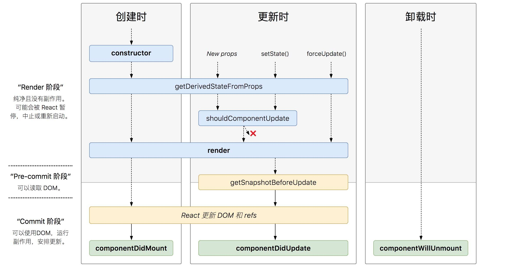

## React 生命周期
>React 17.0 版本： 推出新的渲染方式——异步渲染（ Async Rendering），提出一种可被打断的生命周期，而可以被打断的阶段正是实际 dom 挂载之前的虚拟 dom 构建阶段，也就是要被去掉的三个生命周期 componentWillMount，componentWillReceiveProps 和 componentWillUpdate。
### Mount

constructor()
<s>componentWillMount()</s>/可以constructor来替代
render()
componentDidMount()

### Update

<s>componentWillReceiveProps()</s> / static getDerivedStateFromProps()
shouldComponentUpdate()
<s>componentWillUpdate()</s> / getSnapshotBeforeUpdate()
render()
componentDidUpdate()

### Unmount

componentWillUnmount()




## 更新的周期

### static getDerivedStateFromProps(nextProps,prevState)
>直译：从props上派生state

参数：接收父组件传递过来的 props 和组件之前的状态，返回一个对象来更新 state 或者返回 null 来表示接收到的 props 没有变化，不需要更新 state

该生命周期钩子的作用： 将父组件传递过来的 props 映射 到子组件的 state 上面，这样组件内部就不用再通过 this.props.xxx 获取属性值了，统一通过 this.state.xxx 获取。

该生命周期钩子触发的时机：在组件实例化、接收到新的 props 、组件状态更新时会被调用

最常见的误解就是 getDerivedStateFromProps 和 componentWillReceiveProps 只会在 props “改变”时才会调用。实际上只要父组件重新渲染时，这两个生命周期函数就会重新调用，不管 props 有没有“变化”


```
 	// 根据新的属性对象派生状态对象    
  // nextProps——新的属性对象 prevState——旧的状态对象
  static getDerivedStateFromProps(nextprops, state) {
    console.log('props',nextprops);
    // 返回一个对象来更新 state 或者返回 null 来表示接收到的 props 不需要更新 state 
    if (nextprops.age !== state.age) {
      console.log("更新吧");
      return {
        onChangeParent:nextprops.onChangeParent,
        age: nextprops.age,
        // 注意：这里不需要把组件自身的状态也放进来
        // num:state.num
      };
    }
    return null;// 不需要更新
  }

```

注意：getDerivedStateFromProps 是一个静态方法，而组件实例无法继承静态方法，所以该生命周期钩子内部无法通过使用 this 获取组件实例的属性/方法。

可以通过static方法，然后AAA.fn调用，或者直接把方法放到全局
```
class AAA extends React.Component {

  static getDerivedStateFromProps(nextProps, prevState) {
    if (nextProps.id !== prevState.prevId) {
      const data = AAA.filterFn(nextProps.data);
      return {
        data,
        prevId: nextProps.id,
      };
    }
    return null;
  }
  
  static filterFn(data){
  	// 过滤数据
    
    ...
    
    return newData;
  }
  
  ...
}

```

### getSnapshotBeforeUpdate(prevProps, prevState)
>直译：在更新前获得快照

接收父组件传递过来的 props 和组件之前的状态，此生命周期钩子必须有返回值，返回值将作为第三个参数传递给 componentDidUpdate。**必须和 componentDidUpdate 一起使用**，否则会报错

该生命周期钩子触发的时机 ：被调用于 render 之后、更新 DOM 和 refs 之前
该生命周期钩子的作用：在元素被渲染并写入 DOM 之前调用，这样，你在 DOM 更新前捕获 DOM 信息（例如：滚动位置）。
配合 componentDidUpdate, 可以覆盖 componentWillUpdate 的所有用法

```
//每次组件更新时，都去获取之前的滚动位置，让组件保持在之前的滚动位置
 getSnapshotBeforeUpdate() {
    // 返回更新内容的高度 300px
    return this.wrapper.current.scrollHeight;
  }
  componentDidUpdate(prevProps, prevState, prevScrollHeight) {
    this.wrapper.current.scrollTop =
      this.wrapper.current.scrollTop +
      (this.wrapper.current.scrollHeight - prevScrollHeight);
  }

```

## componentDidCatch()

这个生命周期方法在ErrorBoundary类中使用。实际上，如果使用这个生命周期方法，任何类都会变成ErrorBoundary。这用于在组件树中出现错误时记录错误。

## 参考

- https://juejin.im/post/5df648836fb9a016526eba01#heading-0