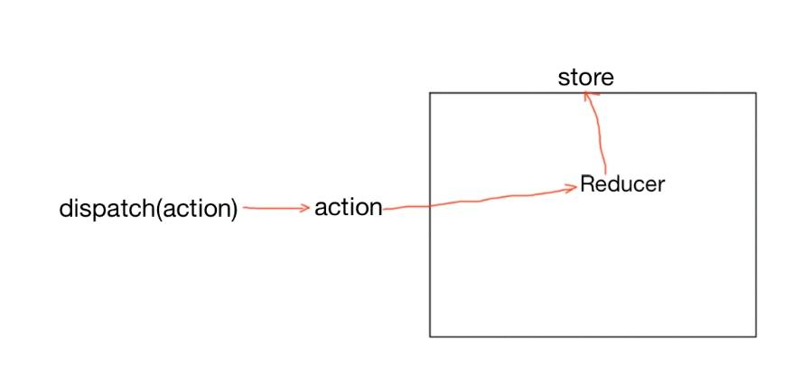
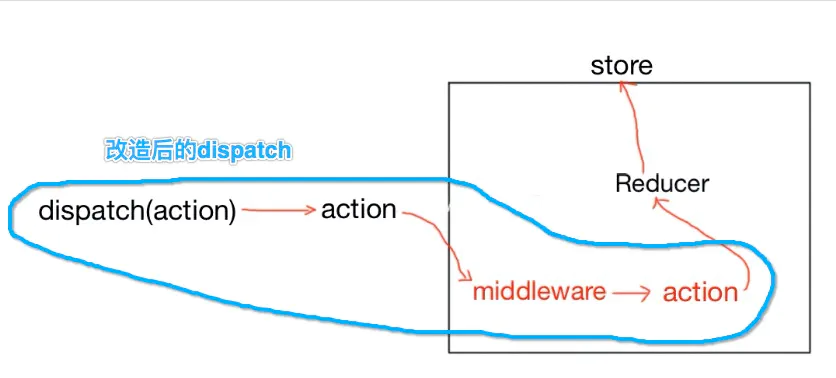
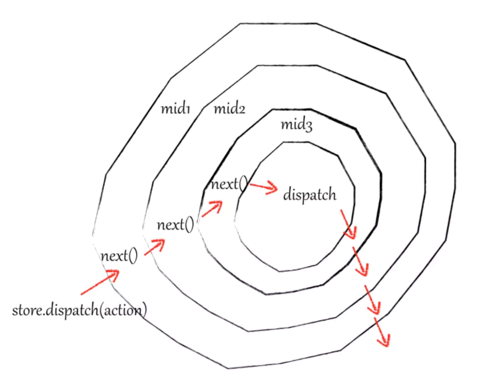
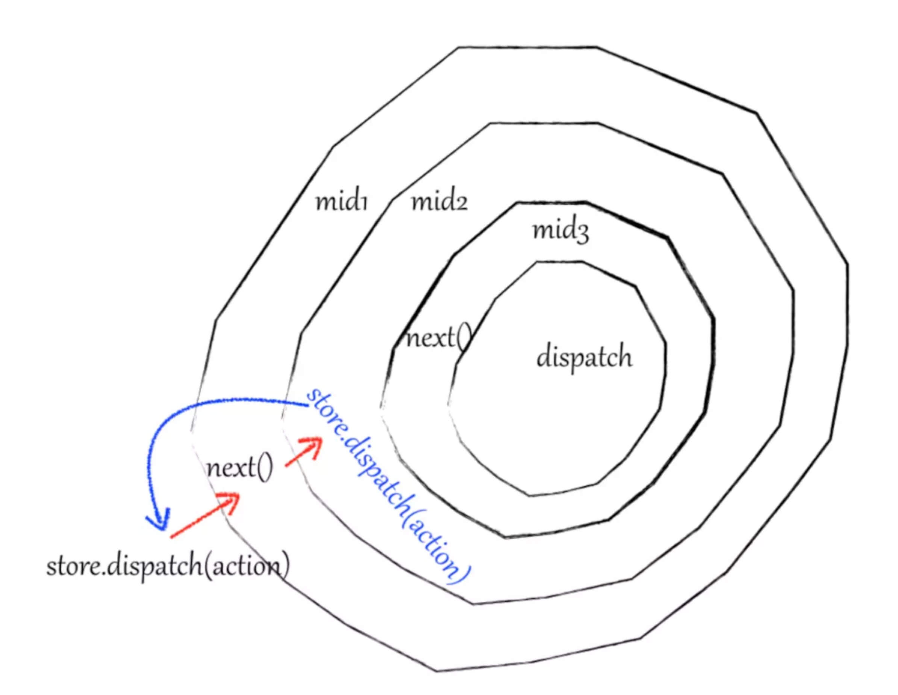

> dva.js 用顺手了，快一年没用过redux了，突然拿到一个基于redux的项目有点都快看不懂了，温习一下

## connect 高级组件（函数

### 为什么connect的组件在store改变时会自动渲染
>https://didiheng.com/front/2019-12-20.html#provider%E5%87%BD%E6%95%B0

因为 connect 中订阅了 store 的更新，当 store 更新时，就会重新执行 mapStateToProps，将结果重新注入。从而使视图更新。

connect函数生成一个订阅商店的包装器组件。分派操作时，将通知包装器组件的回调。然后，它将运行您的mapState函数，并且将浅比较这一次的结果对象与上一次的结果对象进行比较（因此，如果您将重写一个具有相同值的redux存储字段，它将不会触发重新渲染。如果结果不同，则将结果作为道具传递给您的“真实”组件。

是在高阶组件（connect 函数返回的组件）里的 componentDidMount 订阅 store 更新，和 componentWillUnmount 取消订阅。

下面是一个伪代码
```
function connect(mapStateToProps, mapDispatchToProps) {
  return function (WrappedComponent) {
    return class extends React.Component {
      render() {
        return (
          // that renders your component
          <WrappedComponent
            {/* with its props  */}
            {...this.props}
            {/* and additional props calculated from Redux store */}
            {...mapStateToProps(store.getState(), this.props)}
            {...mapDispatchToProps(store.dispatch, this.props)}
          />
        )
      }
      
      componentDidMount() {
        this.unsubscribe = store.subscribe(this.handleChange.bind(this))
      }
      
      componentWillUnmount() {
        this.unsubscribe()
      }
    
      handleChange() {
        // 真实的从新渲染是调用mapStateToProps来从新计算组件的参数 并还要做一些比较来判断是否从新渲染 且采用的是setState？
        this.forceUpdate()
      }
    }
  }
}

const ConnectedCounter = connect(
  // Given Redux state, return props
  state => ({
    value: state.counter,
  }),
  // Given Redux dispatch, return callback props
  dispatch => ({
    onIncrement() {
      dispatch({ type: 'INCREMENT' })
    }
  })
)(Counter)
```

connect(mapStateToProps) 用来将更新好的数据传给组件，然后触发 React 重新渲染，显示最新的状态。它架设起 Redux 和 React 之间的数据通信桥梁。

也就是说你connect一个组件，在connect内部会把一个更新函数推入store的订阅队列。然后你在组件里dispatch后会在一个地方取把订阅队列里的更新函数取出来执行，从而达到从新渲染页面的效果。

## mapStateToProps（state, ownProps）

这个单词翻译过来就是把state映射到props中去 ,其实也就是把Redux中的数据映射到React中的props中去。

- mapStateToProps是一个函数，用于建立组件跟store的state的映射关系
作为一个函数，它可以传入两个参数，结果一定要返回一个object
- 传入mapStateToProps之后，会订阅store的状态改变，在每次store的state发生变化的时候，都会被调用
- ownProps代表组件本身的props，如果写了第二个参数ownProps，那么当prop发生变化的时候，mapStateToProps也会被调用。例如，当 props接收到来自父组件一个小小的改动，那么你所使用的 ownProps 参数，mapStateToProps 都会被重新计算）。
- mapStateToProps可以不传，如果不传，组件不会监听store的变化，也就是说Store的更新不会引起UI的更新

## mapDispatchToProps

这个单词翻译过来就是就是把各种dispatch也变成了props让你可以直接使用

## reducer是一个纯函数

在redux的设计思想中，reducer应该是一个纯函数。
- 相同的输入产生相同的输出（不能在内部使用Math.random,Date.now这些方法影响输出）
- 输出不能和输入值以外的任何东西有关（不能调用API获得其他数据）
- 函数内部不能影响函数外部的任何东西（**不能直接改变传入的引用变量，而是从新创建一个返回**），即不会突变

## 为什么reducer应该是一个纯函数

- state是根据reducer创建出来的，所以reducer是和state紧密相关的，对于state，我们有时候需要有一些需求（比如打印每一次更新前后的state，或者回到某一次更新前的state）这就对reducer有一些要求。

- 纯函数更易于调试
  - 比如我们调试时希望action和对应的新旧state能够被打印出来，如果新state是在旧state上修改的，即使用同一个引用，那么就不能打印出新旧两种状态了。
  - 如果函数的输出具有随机性，或者依赖外部的任何东西，都会让我们调试时很难定位问题。

- 如果不使用纯函数，那么在比较新旧状态对应的两个对象时，我们就不得不深比较了，深比较是非常浪费性能的。相反的，如果对于所有可能被修改的对象（比如reducer被调用了一次，传入的state就可能被改变），我们都新建一个对象并赋值，两个对象有不同的地址。那么浅比较就可以了。
  
reducer是一个纯函数，那么如果我们在应用中确实需要处理一些副作用（比如异步处理，调用API等操作），那么该怎么办呢？ 使用中间件来解决

## 中间件的作用

- dispatch一个“action”（不一定是标准的action）
- 这个“action”先被中间件处理（比如在这里发送一个异步请求）
- 中间件处理结束后，再发送一个"action"（有可能是原来的action，也可能是不同的action因中间件功能不同而不同）
- 中间件发出的"action"可能继续被另一个中间件处理，进行类似3的步骤。即中间件可以链式串联。
- 最后一个中间件处理完后，dispatch一个符合reducer处理标准的action（纯对象action）
- 这个标准的action被reducer处理，
- reducer根据action更新store（中的state）

看看不用中间件时的redux工作流程：



使用中间件改造后的dispatch：



redux提供了一种解决方案，将中间件的串联操作进行了封装，经过封装后，上面的步骤在到达Reducer之前可以成为一个整体

## 在redux中使用中间件

redux 的createStore()方法的第三个参数enhancer，enhancer（可以叫做强化器）是一个函数，这个函数接受一个「普通createStore函数」作为参数，返回一个「加强后的createStore函数」。

这个加强的过程中做的事情，其实就是改造dispatch，添加上中间件。

redux提供的applyMiddleware()方法返回的就是一个enhancer。
```
function createStore(reducer, preloadedState, enhancer) {
    if(enhancer是有效的){  
        return enhancer(createStore)(reducer, preloadedState)
    } 
    
    //...
}

```
## applyMiddleware

### applyMiddleware的工作方式


- 调用（若干个）中间件函数，获取（若干个）改造函数
- 把所有改造函数compose成一个改造函数
- 改造dispatch方法，传入compose函数里的所有函数都是用于扩展dispatch的，这些函数会被定义为这种形式
  
```
function applyMiddleware(...middlewares) {
    // 返回一个函数A，函数A的参数是一个createStore函数。
    // 函数A的返回值是函数B，其实也就是一个加强后的createStore函数，大括号内的是函数B的函数体
    return createStore => (...args) => {
        //用参数传进来的createStore创建一个store
        const store  = createStore(...args)
        //注意，我们在这里需要改造的只是store的dispatch方法
        
        let dispatch = () => {  //一个临时的dispatch
            					//作用是在dispatch改造完成前调用dispatch只会打印错误信息
            throw new Error(`一些错误信息`)
        } 
        //接下来我们准备将每个中间件与我们的state关联起来（通过传入getState方法），得到改造函数。
        const middlewareAPI = {
            getState: store.getState,
            dispatch: (...args) => dispatch(...args)
        }
        //middlewares是一个中间件函数数组，中间件函数的返回值是一个改造dispatch的函数
        //调用数组中的每个中间件函数，得到所有的改造函数
        const chain = middlewares.map(middleware => middleware(middlewareAPI))
        
        //将这些改造函数compose（翻译：构成，整理成）成一个函数
        //用compose后的函数去改造store的dispatch
        dispatch = compose(...chain)(store.dispatch)
        // compose方法的作用是，例如这样调用：
        // compose(func1,func2,func3)
        // 返回一个函数: (...args) => func1( func2( func3(...args) ) )
        // 即传入的dispatch被func3改造后得到一个新的dispatch，新的dispatch继续被func2改造...
        
        // 返回store，用改造后的dispatch方法替换store中的dispatch
        return {
            ...store,
            dispatch
        }
    }
}

```
源码中用到了一个很有用的方法：compose()，将多个函数组合成一个函数。理解这个函数对理解中间件很有帮助，我们来看看它的源码：
```
function compose(...funcs) {
    // 当未传入函数时，返回一个函数：arg => arg
    if(funcs.length === 0) {
        return arg => arg
    }
    
    // 当只传入一个函数时，直接返回这个函数
    if(funcs.length === 1) {
        return funcs[0]
    }
    
    // 返回组合后的函数
    return funcs.reduce((a, b) => (...args) => a(b(...args)))
    
    //reduce是js的Array对象的内置方法
    //array.reduce(callback)的作用是：给array中每一个元素应用callback函数
    //callback函数：
    /*
     *@参数{accumulator}：callback上一次调用的返回值
     *@参数{value}：当前数组元素
     *@参数{index}：可选，当前元素的索引
     *@参数{array}：可选，当前数组
     *
     *callback( accumulator, value, [index], [array])
    */
}

```

### 多个中间件的洋葱模型

  ​
中间件中的next参数，用来将action传递到下一个中间件中，通过上面的转换可以看出来：
- thunk函数中的next等于promise(logger(..args))
- promise函数中的next等于logger(...args)

传入compose函数里的所有函数都是用于扩展dispatch的，这些函数会被定义为这种形式：
```
(dispatch) => {
  return function(...args) {
    // do something before
    dispatch(...args)
    // do something after
  }
}

```
```
  const thunk = thunk(middlewareAPI);
  const promise = promise(middlewareAPI);
  const logger = logger(middlewareAPI);
  ​
  const chain = [thunk, promise, logger];
  ​
  compose(...chain)
     ↓ ↓ ↓ ↓ ↓ ↓
  (...args) => thunk(promise(logger(...args)))

  最终生成的dispatch函数可以表示为：
  dispatch = compose(...chain)(store.dispatch) 
    ↓ ↓ ↓ ↓ ↓ ↓
  dispatch = thunk(promise(logger(store.dispatch)))

  ​
  因为闭包的原因，最终生成的dispatch函数将会传入到每个中间件中。
```
logger = logger(middlewareAPI);这里返回的logger已经类似于一个
```
function(next){
  // 这里的next可以理解为store.dispath,本质上就是调用 middleware 链中下一个 middleware 的 dispatch。
      return function(action){
        console.log('老状态1 ',getState());
        next(action);//派发动作 nexts是下一个 middleware 修改后的 dispatch。
        console.log('新状态1 ',getState());
    }
    }
```

每一个middleware中store的dispatch函数通过闭包的作用，都和compose函数最终生成的dispatch保持一致，并且原生的dispatch函数被包裹在最内层，middleware通过调用next()函数进入下一个中间件，并最终调用原生的dispatch函数实现action的分发，具体的过程如下图



如果在某一个中间件中调用了store.dispatch，那么就相当于从当前的中间件中跳出，重新执行一遍上图中的过程。如果中间件一直粗暴的执行store.dispatch而没有一个合适的状态去调用next函数，那么就会进入一个死循环中。具体的过程如下图




### 中间件函数的工作方式是：

中间件是一个函数，不妨叫做中间件函数
中间件函数的输入是store的getState和dispatch，输出为改造函数（改造dispatch的函数）
改造函数输入是一个dispatch，输出「改造后的dispatch」


直接来看一个啥都不干的中间件是如何实现的：

```
const doNothingMidddleware = (dispatch, getState) => next => action => next(action)

```
日志记录的中间件：

```
let logger = function({ getState, dispatch }){
   return function(next){// 这里的next可以理解为store.dispath,本质上就是调用 middleware 链中下一个 middleware 的 dispatch。
      return function(action){
        console.log('老状态1 ',getState());
        next(action);//派发动作 next - 下一个中间件修改后的dispatch
        console.log('新状态1 ',getState());
    }
    }
}
// 高逼格写法
let logger = ({ getState, dispatch }) => next => action => {
  console.log('老状态1 ',getState());
  next(action)
  console.log('新状态1 ',getState());
}

```

简化后的thunk中间件：
```
// 这是简化后的 redux-thunk
const thunk = ({ dispatch, getState }) => next => action => {
    if (typeof action === 'function') {
      return action(dispatch, getState);
    }
    return next(action);
  };
```

## 为什么使用redux-thunk调用API

因为reduce是纯函数，所以没有副作用，调用API返回的数据具有可变性就不纯了。
因此，我们必须使用redux-thunk从 action creators 那里进行 API 调用。Action creator 派发一个action，将来自API的数据放入action 的 payload 中。


## redux-thunk 中间件

redux-thunk实现了相关异步流程内聚到redux的流程中，实现middleware的功能，也便于项目的开发与维护，避免冗余代码。而实现的方式便是改写redux中的dispatch API，使其可以除PlainObject外，接受一个函数作为参数。

直接将thunk中间件引入，放在applyMiddleware方法之中，传入createStore方法，就完成了store.dispatch()的功能增强。即可以在reducer中进行一些异步的操作。
```
import { applyMiddleware, createStore } from 'redux';
import thunk from 'redux-thunk';

const store = createStore(
    reducers, 
    applyMiddleware(thunk)
);
```

终结目的就是让dispatch()的参数可以是函数，然后redux-thunk处理这个函数返回一个对象，然后才真正发给reducers

## redux-thunk 内部干了什么


redux-thunk最重要的思想，就是可以接受一个返回函数的action creator。如果这个action creator 返回的是一个函数，就执行它，如果不是，就按照原来的next(action)执行。

因为这个action creator可以返回一个函数，那么就可以在这个函数中执行一些异步的操作

```


function createThunkMiddleware(extraArgument) {
  return ({ dispatch, getState }) => next => action => {
    if (typeof action === 'function') {
      return action(dispatch, getState, extraArgument);
    }

    return next(action);
  };
}

```
三个箭头函数让你有点头晕，我来帮你展开一下：
```
function createThunkMiddleware(extraArgument) {
    
    return function({ dispatch, getState }) { // 这是「中间件函数」
        //参数是store中的dispatch和getState方法
        
        return function(next) { // 这是中间件函数创建的「改造函数」
            //参数next是被当前中间件改造前的dispatch
            //因为在被当前中间件改造之前，可能已经被其他中间件改造过了，所以不妨叫next
            
            return function(action) { // 这是改造函数「改造后的dispatch方法」
                if (typeof action === 'function') {
                  //如果action是一个函数，就调用这个函数，并传入参数给函数使用
                  return action(dispatch, getState, extraArgument);
                }
                
                //否则调用用改造前的dispatch方法
                return next(action);
            }
        } 
    }
}

```

可以看出redux-thunk严格遵循了redux中间件的思想：在原始的dispatch方法触发reducer处理之前，处理副作用。

## 注册redux-thunk

```
import { createStore, compose, applyMiddleware } from "redux";
import thunk from "redux-thunk";
import reducer from "./reducer";
const composeEnhancers = window.__REDUX_DEVTOOLS_EXTENSION_COMPOSE__ || compose;

const store = createStore(reducer, composeEnhancers(applyMiddleware(thunk)));

export default store;
```


## 组件将state和Dispatch注入


```
const mapStateToProps = (state) => ({
  bannerList: state.getIn(['recommend', 'bannerList']),
  recommendList: state.getIn(['recommend', 'recommendList']),
  songsCount: state.getIn(['player', 'playList']).size,
  enterLoading: state.getIn(['recommend', 'enterLoading'])
});
// 映射dispatch到props上
const mapDispatchToProps = (dispatch) => {
  console.log(2)
  return {
    getBannerDataDispatch() {
      dispatch(actionTypes.getBannerList());
    },
    getRecommendListDataDispatch() {
      dispatch(actionTypes.getRecommendList());
    },

  }
};

export default connect(mapStateToProps, mapDispatchToProps)(React.memo(RecommendMy));
```
## 为什么要求reducer必须是纯函数，且不能有异步
>https://github.com/Advanced-Frontend/Daily-Interview-Question/issues/65


如果你经常用React+Redux开发，那么就应该了解Redux的设计初衷。Redux的设计参考了Flux的模式，作者希望以此来实现时间旅行，保存应用的历史状态，实现应用状态的可预测。所以整个Redux都是函数式编程的范式，要求reducer是纯函数也是自然而然的事情，使用纯函数才能保证相同的输入得到相同的输入，保证状态的可预测。所以Redux有三大原则：

单一数据源，也就是state
state 是只读，Redux并没有暴露出直接修改state的接口，必须通过action来触发修改
使用纯函数来修改state，reducer必须是纯函数

reducer是用来计算state的，所以它的返回值必须是state，也就是我们整个应用的状态，而不能是promise之类的。


要在reducer中加入异步的操作，如果你只是单纯想执行异步操作，不会等待异步的返回，那么在reducer中执行的意义是什么。如果想把异步操作的结果反应在state中，首先整个应用的状态将变的不可预测，违背Redux的设计原则，其次，此时的currentState将会是promise之类而不是我们想要的应用状态，根本是行不通的。
因为异步操作是成功还是失败不可预测，什么时候进行异步操作也不可预测；当异步操作成功或失败时，如果不 commit(mutation) 或者 dispatch(action)，Vuex 和 Redux 就不能捕获到异步的结果从而进行相应的操作，实质上任何在回调函数中进行的状态的改变都是不可追踪的。


### api/request
```
import { axiosInstance } from "./config";

export const getBannerRequest = () => {
  return axiosInstance.get("/banner");
};

export const getRecommendListRequest = () => {
  return axiosInstance.get("/personalized");
};
```

### actionCreators
```
import * as actionTypes from './constants';
import { fromJS } from 'immutable';
import { getBannerRequest, getRecommendListRequest } from '../../../api/request';


// 这里就是调用getBannerList返回一个函数，给dispatch，然后thunk中间件判断是函数先执行拿到网络请求后的数据后再发dispatch
export const getBannerList = () => {
  console.log(123)
  return (dispatch) => {
    console.log(dispatch)
    getBannerRequest().then(data => {
      console.log(data)
      const action = changeBannerList(data.banners);
      dispatch(action);
    }).catch(() => {
      console.log("轮播图数据传输错误");
    }) 
  }
};

export const getRecommendList = () => {
  return (dispatch) => {
    getRecommendListRequest().then(data => {
      dispatch(changeRecommendList(data.result));
      dispatch(changeEnterLoading(false));
    }).catch(() => {
      console.log("推荐歌单数据传输错误");
    });
  }
};


// 这里返回的action是经过thunk处理了，没有副作用了给最后的reducer用的
export const changeBannerList = (data) => ({
  type: actionTypes.CHANGE_BANNER,
  data: fromJS(data)
});

export const changeRecommendList = (data) => ({
  type: actionTypes.CHANGE_RECOMMEND_LIST,
  data: fromJS(data)
});

export const changeEnterLoading = (data) => ({
  type: actionTypes.CHANGE_ENTER_LOADING,
  data
});
```

### reducer

```
import * as actionTypes from './constants';
import { fromJS } from 'immutable';

const defaultState = fromJS({
  bannerList: [],
  recommendList: [],
  enterLoading: true
})

export default (state = defaultState, action) => {
  switch(action.type) {
    case actionTypes.CHANGE_BANNER:
      return state.set('bannerList', action.data);
    case actionTypes.CHANGE_RECOMMEND_LIST:
      return state.set('recommendList', action.data);
    case actionTypes.CHANGE_ENTER_LOADING:
      return state.set('enterLoading', action.data);
    default:
      return state;
  }
}
```

## redux-saga

- https://juejin.im/post/6844903503500935176#heading-0
- https://juejin.im/post/6844903728730865672
- https://juejin.im/post/6844903571192823816

## 参考

- https://juejin.im/post/6844903674116833294#heading-10
- https://juejin.im/post/6844903602926927880#heading-3
- https://juejin.im/post/6844903846666321934#heading-12
- https://juejin.im/post/6844903732786757646#heading-8
