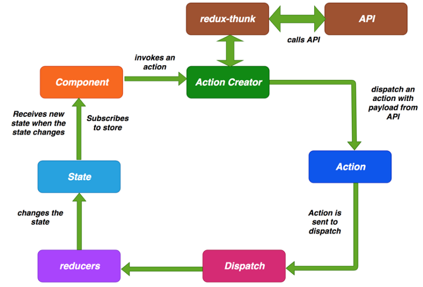

> dva.js 用顺手了，快一年没用过redux了，突然拿到一个基于redux的项目有点都快看不懂了，温习一下

## 为什么使用redux-thunk调用API

因为reduce是纯函数，所以没有副作用，调用API返回的数据具有可变性就不纯了。
因此，我们必须使用redux-thunk从 action creators 那里进行 API 调用。Action creator 派发一个action，将来自API的数据放入action 的 payload 中。



## redux-thunk 中间件

redux-thunk实现了相关异步流程内聚到redux的流程中，实现middleware的功能，也便于项目的开发与维护，避免冗余代码。而实现的方式便是改写redux中的dispatch API，使其可以除PlainObject外，接受一个函数作为参数。

直接将thunk中间件引入，放在applyMiddleware方法之中，传入createStore方法，就完成了store.dispatch()的功能增强。即可以在reducer中进行一些异步的操作。
```
import { applyMiddleware, createStore } from 'redux';
import thunk from 'redux-thunk';

const store = createStore(
    reducers, 
    applyMiddleware(thunk)
);
```

终结目的就是让dispatch()的参数可以是函数，然后redux-thunk处理这个函数返回一个对象，然后才真正发给reducers

## redux-thunk 内部干了什么


redux-thunk最重要的思想，就是可以接受一个返回函数的action creator。如果这个action creator 返回的是一个函数，就执行它，如果不是，就按照原来的next(action)执行。

因为这个action creator可以返回一个函数，那么就可以在这个函数中执行一些异步的操作

```

function createThunkMiddleware(extraArgument) {
    return function({ dispatch, getState }) {
        return function(next){
            return function(action){
                if (typeof action === 'function') {
                    return action(dispatch, getState, extraArgument);
                }

                return next(action);
            };
        }
    }
}


```

## 将state和Dispatch注入


```
export const getBannerList = () => {
  console.log(123)
  return (dispatch) => {
    console.log(dispatch)
    getBannerRequest().then(data => {
      console.log(data)
      const action = changeBannerList(data.banners);
      dispatch(action);
    }).catch(() => {
      console.log("轮播图数据传输错误");
    }) 
  }
};
```

```
const mapStateToProps = (state) => ({
  bannerList: state.getIn(['recommend', 'bannerList']),
  recommendList: state.getIn(['recommend', 'recommendList']),
  songsCount: state.getIn(['player', 'playList']).size,
  enterLoading: state.getIn(['recommend', 'enterLoading'])
});
// 映射dispatch到props上
const mapDispatchToProps = (dispatch) => {
  console.log(2)
  return {
    getBannerDataDispatch() {
      actionTypes.getBannerList()
      //dispatch(actionTypes.getBannerList());
    },
    getRecommendListDataDispatch() {
      dispatch(actionTypes.getRecommendList());
    },

  }
};

export default connect(mapStateToProps, mapDispatchToProps)(React.memo(RecommendMy));
```

